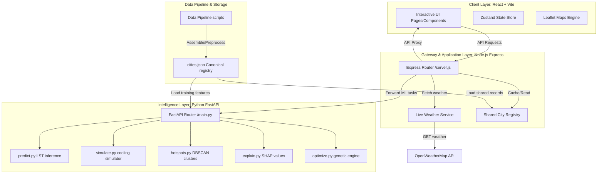

# System Architecture — UrbanHeat AI

UrbanHeat AI is designed with a service-oriented, modular architecture optimized for rapid processing of remote sensing datasets, real-time climate telemetry, and interactive planning simulations.

---

## 1. Client Layer (Frontend)
- **Framework**: React 19 + TypeScript 6 + Vite 8
- **Styling**: Vanilla CSS with Tailwind CSS v4 (native build integration)
- **State Management**: Zustand
- **Visualization**: Recharts for climate stats, Leaflet for geospatial heat maps

## 2. Orchestration & Gateway Layer (Backend)
- **Runtime**: Node.js + Express
- **Responsibilities**:
  - Exposes authentication endpoints (`/auth`) and user registries
  - Serves administrative logs and dashboard telemetry (`/admin`)
  - Pulls and caches real-time temperatures (`/weather`) from the OpenWeatherMap API
  - Forwards computationally heavy prediction, optimization, and clustering requests to the `ml-engine`
  - Consolidates PDF reporting and LLM-assisted chats (`/assistant`)

## 3. Intelligence Layer (ML Engine)
- **Runtime**: Python 3 + FastAPI
- **Responsibilities**:
  - Evaluates Land Surface Temperature (LST) dynamics using features like building density, relative humidity, and albedo
  - Performs spatial clustering (DBSCAN-like) to detect heat hotspots
  - Approximates game-theoretic explanations (SHAP) for prediction transparency
  - Solves linear multi-variable planning optimizations (Greedy budget/cooling optimization)

## 4. Data Layer & Pipelines
- **Data Repository**: `data-pipeline/data/cities.json` serves as the single source of truth for city records
- **Python Pipelines**: Satellite bands extraction and feature engineering script templates
